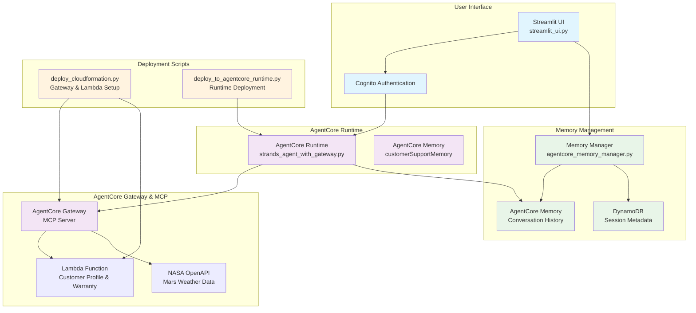
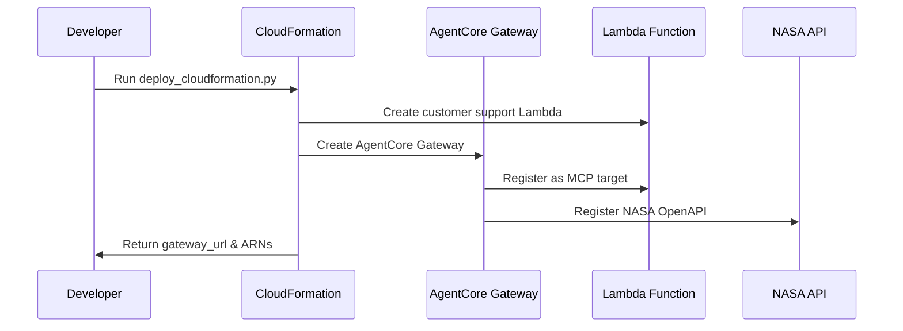
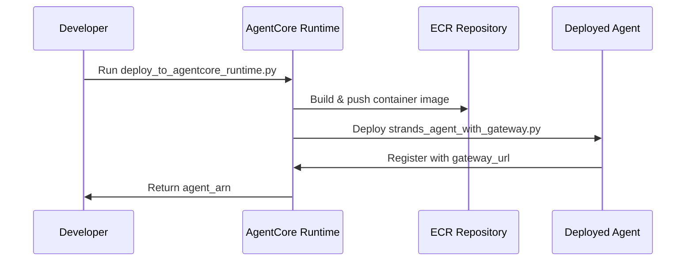
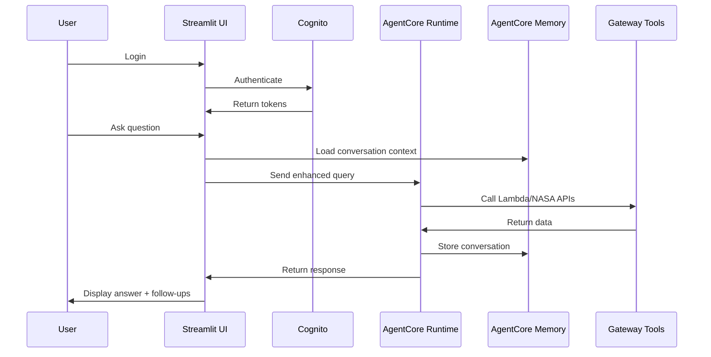

# 🤖 Customer Support Agent with AgentCore Integration

A comprehensive customer support agent built with AWS Bedrock AgentCore, featuring intelligent memory management, session persistence, and multi-tool integration through MCP (Model Context Protocol).

## 🏗️ Architecture Overview



## 🚀 System Flow

### 1. Infrastructure Setup


### 2. Agent Runtime Deployment


### 3. User Interaction Flow


## 📁 Project Structure

```
customer-support-agent-example/
├── 🎯 Core Application
│   ├── streamlit_ui.py                    # Main Streamlit interface
│   ├── strands_agent_with_gateway.py      # AgentCore runtime agent
│   └── config.py                          # Configuration settings
│
├── 🚀 Deployment Scripts
│   ├── deploy_cloudformation.py           # Gateway & Lambda setup
│   ├── deploy_to_agentcore_runtime.py     # Runtime deployment
│   └── setup_cognito.py                   # Authentication setup
│
├── 🧠 Memory Management
│   └── utils/
│       ├── agentcore_memory_manager.py    # Main memory controller
│       ├── session_manager.py             # Session utilities
│       └── memory_helpers.py              # Helper functions
│
├── 🛠️ Infrastructure
│   ├── infrastructure/
│   │   ├── cloudformation/
│   │   │   └── customer-support.yaml      # CloudFormation template
│   │   └── lambda-functions/
│   │       └── streamable_http_sigv4.py   # Lambda function code
│   └── openapi-specs/
│       └── nasa_mars_insights.json        # NASA API specification
│
├── 🔧 Tools & Agents
│   ├── agents/
│   │   ├── runtime_agent.py               # Runtime agent logic
│   │   └── strands_agents.py              # Strands framework agents
│   └── tools/
│       └── web_search.py                  # Additional tools
│
└── 📋 Configuration
    ├── deployment_info.json               # Deployment metadata
    ├── cognito_config.json               # Auth configuration
    ├── requirements.txt                   # Python dependencies
    └── .env                              # Environment variables
```

## 🔧 Key Components

### 1. AgentCore Gateway & MCP Integration

**Purpose**: Exposes Lambda functions and NASA OpenAPI as tools through MCP protocol

**Files**:
- `deploy_cloudformation.py` - Creates gateway and registers targets
- `infrastructure/cloudformation/customer-support.yaml` - Infrastructure template
- `openapi-specs/nasa_mars_insights.json` - NASA API specification

**Features**:
- ✅ Customer profile lookup via Lambda
- ✅ Warranty status checking via Lambda  
- ✅ Mars weather data via NASA OpenAPI
- ✅ Automatic tool discovery through MCP

### 2. AgentCore Runtime Agent

**Purpose**: Intelligent agent with access to gateway tools and memory

**Files**:
- `strands_agent_with_gateway.py` - Main agent implementation
- `deploy_to_agentcore_runtime.py` - Deployment script

**Features**:
- ✅ Strands framework integration
- ✅ Bedrock Claude model usage
- ✅ MCP client for tool access
- ✅ Memory-enhanced responses

### 3. Memory Management System

**Purpose**: Persistent conversation history and user preferences

**Files**:
- `utils/agentcore_memory_manager.py` - Core memory operations

**Features**:
- ✅ **AgentCore Memory Integration**:
  - `store_message()` - Stores conversations using `create_event()`
  - `get_session_messages()` - Retrieves history using `list_events()`
  - `delete_session()` - Removes sessions using `delete_event()`

- ✅ **DynamoDB Session Management**:
  - Session metadata storage
  - User session listing
  - Session creation/deletion

- ✅ **Intelligent Features**:
  - Conversation context extraction
  - User preference learning
  - Follow-up question generation

### 4. Streamlit User Interface

**Purpose**: Interactive web interface with session management

**Files**:
- `streamlit_ui.py` - Main UI application

**Features**:
- ✅ **Authentication**: Cognito integration
- ✅ **Session Management**: 
  - Session switching with history loading
  - Session deletion with confirmation
  - New session creation
- ✅ **Sample Queries**: Pre-built query buttons
- ✅ **Follow-up Questions**: AI-generated suggestions
- ✅ **Memory Integration**: Context-aware conversations

## 🎯 Sample Queries & Follow-up Generation

### Customer Profile Queries
```javascript
// Sample queries automatically generate follow-ups based on user preferences
"Can you look up customer profile for customer_id CUST001?"
→ Follow-ups: "Update profile info?", "Check communication preferences?"

"Find customer profile for email john.smith@email.com" 
→ Follow-ups: "View order history?", "Update contact details?"
```

### Warranty Status Queries
```javascript
"Check warranty status for serial number ABC12345678"
→ Follow-ups: "Explain warranty coverage?", "Start warranty claim?"

"What's the warranty status for my Gaming Console Pro?"
→ Follow-ups: "Check other products?", "Warranty claim process?"
```

### Mars Weather Queries
```javascript
"What is the current weather on Mars?"
→ Follow-ups: "Mars atmospheric conditions?", "Historical weather data?"
```

### Follow-up Generation Strategy

The system uses **AgentCore Memory User Preference Strategy** to generate contextual follow-ups:

1. **Preference Learning**: Analyzes conversation history to identify user interests
2. **Context Awareness**: Considers current query type and previous interactions  
3. **Dynamic Generation**: Creates relevant follow-up questions based on:
   - Common user issues (warranty, account, etc.)
   - Query patterns and topics
   - User communication style
   - Previous conversation context

## 🚀 Quick Start

### 1. Setup Infrastructure
```bash
# Deploy gateway and Lambda functions
python deploy_cloudformation.py

# Setup authentication
python setup_cognito.py
```

### 2. Deploy Agent Runtime
```bash
# Deploy agent to AgentCore runtime
python deploy_to_agentcore_runtime.py
```

### 3. Launch Application
```bash
# Start Streamlit interface
streamlit run streamlit_ui.py
```

### 4. Test Features
1. **Login** with Cognito credentials
2. **Try sample queries** for different use cases
3. **Switch between sessions** to test history loading
4. **Delete old sessions** with confirmation dialog
5. **Use follow-up questions** for continued conversation

## 🔍 Memory Management Details

### AgentCore Memory Operations
```python
# Store conversation
session_manager.store_message(user_id, session_id, query, response)

# Retrieve history  
messages = session_manager.get_session_messages(user_id, session_id)

# Delete session
success = session_manager.delete_session(user_id, session_id)

# Get context for enhanced responses
context = session_manager.get_conversation_context(user_id, session_id, query)
```

### Memory Architecture
- **AgentCore Memory**: Stores actual conversation events
- **DynamoDB**: Stores session metadata for UI display
- **Actor ID Sanitization**: Handles email-based user IDs
- **Event Ordering**: Maintains chronological conversation flow

## 🛡️ Security Features

- ✅ **Cognito Authentication**: Secure user login
- ✅ **IAM Roles**: Proper AWS permissions
- ✅ **Session Isolation**: User-specific memory spaces
- ✅ **Data Encryption**: AWS managed encryption
- ✅ **Actor ID Sanitization**: Secure user identification

## 📊 Monitoring & Logging

- ✅ **CloudWatch Logs**: Runtime and Lambda logging
- ✅ **AgentCore Metrics**: Memory and runtime statistics  
- ✅ **Error Handling**: Graceful failure management
- ✅ **Debug Features**: UI refresh and cache clearing

## 🔄 Deployment Pipeline

1. **Infrastructure** → CloudFormation creates gateway and Lambda
2. **Runtime** → AgentCore deploys containerized agent
3. **Memory** → AgentCore memory initialization
4. **UI** → Streamlit application with authentication
5. **Testing** → Comprehensive validation scripts

This architecture provides a production-ready customer support agent with intelligent memory management, multi-tool integration, and seamless user experience through AgentCore's advanced capabilities.